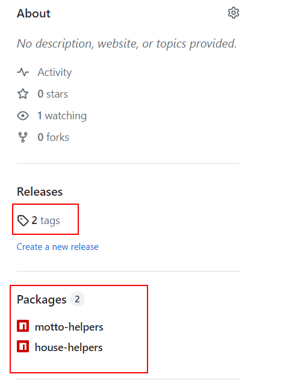
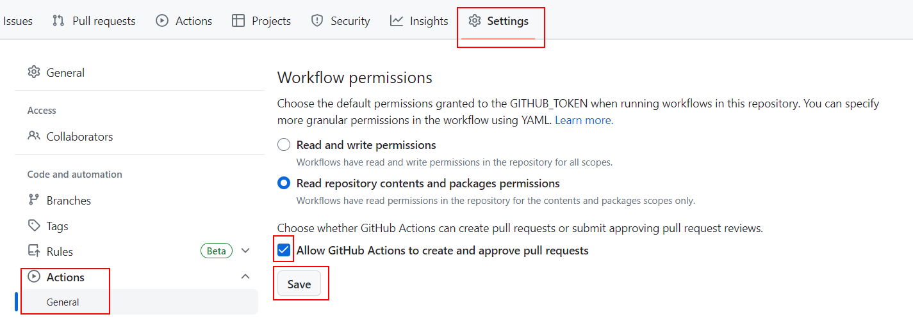

# 04 Auto publish

In this example, we are going to publish, manage versions, create tags, create releases on Github, CHANGELOGS, for all packages in a monorepo.

We will start from `03-manual-publish`.

## Steps to build it

Run `npm install` to install project dependencies.

```bash
npm install
```

This time, we will publish all packages in a private npm registry, so we need to create a Github repository that includes a free tier of 500MB of storage using [Github Packages](https://github.com/features/packages).

Create new repository and upload files:


```bash
git init
git remote add origin git@github.com...
git add .
git commit -m "initial commit"
git push -u origin main

```

This time we will install a third party library to help us with the monorepo package management, [changesets](https://github.com/changesets/changesets) is a tool to manage versioning and changelogs with a focus on multi-package repositories but you can use it in single package repositories too:

```bash
npm install @changesets/cli @changesets/changelog-github --save-dev

```

> Also, we will install `@changesets/changelog-github` to be used in a Github workflow

Create `changesets` config:

```bash
node_modules/.bin/changeset init

```

The command above will create a `.changeset` folder with a `config.js` file:

_./.changeset/config.js_

```diff
{
  "$schema": "https://unpkg.com/@changesets/config@2.3.1/schema.json",
- "changelog": "@changesets/cli/changelog",
+ "changelog": [
+   "@changesets/changelog-github",
+   { "repo": "<user-name>/<repository-name>" }
+ ],
  "commit": false,
  "fixed": [],
  "linked": [],
  "access": "restricted",
  "baseBranch": "main",
  "updateInternalDependencies": "patch",
  "ignore": []
}

```

> `changelog`: We will use `@changesets/cli/changelog` to generate a changelog file in the Github workflow
>
> More info about [changeset config file](https://github.com/changesets/changesets/blob/main/docs/config-file-options.md)

Now, we will create two scripts to help us with the versioning and publish:

_./package.json_

```diff
{
  ...
  "scripts": {
    "start": "turbo start type-check:watch",
    "build": "turbo build",
+   "changeset": "changeset",
+   "publish-packages": "changeset publish"
  },
  ...
}

```

> `changeset`: We will run manually this command when we will create a new changeset (a new version for one or more packages). It will ask you some questions about the changes you made and will create a new changeset file in the `.changeset` folder.
>
> `publish-packages`: We will run automatically this command in a Github workflow when we will create a new release. It will publish all packages in the `.changeset` folder to the npm registry.

Finally, we will create a Github workflow to automate the process:

_./.github/workflows/publish-packages.yml_

```yml
name: Publish Packages

on:
  push:
    branches:
      - main

permissions:
  packages: write
  contents: write
  pull-requests: write
```

> We will the [automatic token authentication](https://docs.github.com/en/actions/security-guides/automatic-token-authentication) (GITHUB_TOKEN) and we will add some permissions to it.

Steps to publish:

_./.github/workflows/publish-packages.yml_

```diff
...

permissions:
  packages: write
  contents: write
  pull-requests: write

+jobs:
+  publish-packages:
+    runs-on: ubuntu-latest
+    steps:
+      - name: Checkout repository
+        uses: actions/checkout@v3

+      - name: Setup Node.js
+        uses: actions/setup-node@v3
+        with:
+          node-version: "18.x"
+          registry-url: "https://npm.pkg.github.com"
+          always-auth: true
+          scope: "@${{ github.repository_owner }}"

+      - name: Install
+        run: npm ci

+      - name: Build
+        run: npm run build

+      - name: Publish Release
+        id: changesets
+        uses: changesets/action@v1
+        with:
+          publish: npm run publish-packages
+        env:
+          GITHUB_TOKEN: ${{ secrets.GITHUB_TOKEN }}
+          NODE_AUTH_TOKEN: ${{ secrets.GITHUB_TOKEN }}
+          NPM_TOKEN: ${{ secrets.GITHUB_TOKEN }}

```

> [actions/checkout](https://github.com/actions/checkout)
>
> [actions/setup-node](https://github.com/actions/setup-node)
>
> The default npm registry is `https://registry.npmjs.org/` but we will use the private [Github npm registry](https://docs.github.com/en/packages/working-with-a-github-packages-registry/working-with-the-npm-registry) `https://npm.pkg.github.com/`
>
> [More info about github context variables](https://docs.github.com/en/actions/learn-github-actions/contexts#github-context)
>
> [changesets/action](https://github.com/changesets/action)

Reset packages versions to `0.0.0`:

_./helpers/house-helpers/package.json_

```diff
{
  "name": "@<user-name>/house-helpers",
- "version": "1.0.0",
+ "version": "0.0.0",
...

```

_./helpers/motto-helpers/package.json_

```diff
{
- "name": "@my-org/motto-helpers",
+ "name": "@<user-name>/motto-helpers",
- "version": "1.0.0",
+ "version": "0.0.0",
...
  "dependencies": {
-   "@my-org/house-helpers": "^1.0.0"
+   "@<user-name>house-helpers": "*"
  }
}

```

> `*`: we don't care about the version of the `house-helpers` package, we will use the last one.

_./helpers/motto-helpers/src/motto.helpers.ts_

```diff
- import { House } from "@my-org/house-helpers";
+ import { House } from "@<user-name>/house-helpers";

const MOTTOS: Record<House, string> = {
  ...
```

_./apps/baratheon/package.json_

```diff
{
  ...
  "dependencies": {
-   "@my-org/house-helpers": "^1.0.0",
+   "@<user-name>/house-helpers": "*",
-   "@my-org/motto-helpers": "^1.0.0",
+   "@<user-name>/motto-helpers": "*",
  ...
}

```

_./apps/baratheon/src/app.component.tsx_

```diff
import './app.css';
import logo from '/logo.png';
- import { House, getHouseTitle } from '@my-org/house-helpers';
+ import { House, getHouseTitle } from '@<user-name>/house-helpers';
- import { getHouseMotto } from '@my-org/motto-helpers';
+ import { getHouseMotto } from '@<user-name>/motto-helpers';
  ...

```

_./apps/lannister/package.json_

```diff
{
  ...
  "dependencies": {
-   "@my-org/house-helpers": "^1.0.0",
+   "@<user-name>/house-helpers": "*",
-   "@my-org/motto-helpers": "^1.0.0",
+   "@<user-name>/motto-helpers": "*",
  ...
}

```

_./apps/lannister/src/app.component.tsx_

```diff
import './app.css';
import logo from '/logo.png';
- import { House, getHouseTitle } from '@my-org/house-helpers';
+ import { House, getHouseTitle } from '@<user-name>/house-helpers';
- import { getHouseMotto } from '@my-org/motto-helpers';
+ import { getHouseMotto } from '@<user-name>/motto-helpers';
  ...

```

_./apps/stark/package.json_

```diff
{
  ...
  "dependencies": {
-   "@my-org/house-helpers": "^1.0.0",
+   "@<user-name>/house-helpers": "*",
-   "@my-org/motto-helpers": "^1.0.0",
+   "@<user-name>/motto-helpers": "*",
  ...
}

```

_./apps/stark/src/app.component.tsx_

```diff
import './app.css';
import logo from '/logo.png';
- import { House, getHouseTitle } from '@my-org/house-helpers';
+ import { House, getHouseTitle } from '@<user-name>/house-helpers';
- import { getHouseMotto } from '@my-org/motto-helpers';
+ import { getHouseMotto } from '@<user-name>/motto-helpers';
  ...

```

_./apps/targaryen/package.json_

```diff
{
  ...
  "dependencies": {
-   "@my-org/house-helpers": "^1.0.0",
+   "@<user-name>/house-helpers": "*",
-   "@my-org/motto-helpers": "^1.0.0",
+   "@<user-name>/motto-helpers": "*",
  ...
}

```

_./apps/targaryen/src/app.component.tsx_

```diff
import './app.css';
import logo from '/logo.png';
- import { House, getHouseTitle } from '@my-org/house-helpers';
+ import { House, getHouseTitle } from '@<user-name>/house-helpers';
- import { getHouseMotto } from '@my-org/motto-helpers';
+ import { getHouseMotto } from '@<user-name>/motto-helpers';
  ...

```

Remove `package-lock.json` and run install to renew it:

```bash
npm install

```

Upload changes to Github repository:

```bash
git add .
git commit -m "configure changesets and create github workflow"
git push

```

The first time, if there are no changesets and no version of any package is published, the workflow will publish the versions of all packages (which have `private` field set to false).



Then, we will create a new change in `house-helper` package:

_./helpers/house-helpers/src/house.models.ts_

```diff
export enum House {
  stark = 'stark',
  targaryen = 'targaryen',
  lannister = 'lannister',
  baratheon = 'baratheon',
+ tyrell = 'tyrell',
}

```

_./helpers/motto-helpers/src/motto.helpers.ts_

```diff
...
const MOTTOS: Record<House, string> = {
  stark: "Winter is Coming!",
  targaryen: "Fire and Blood!",
  lannister: "Hear Me Roar!",
  baratheon: "Ours is the Fury!",
+ tyrell: "",
};
...

```

And we will create a new changeset only for `house-helpers` (`minor` version):

```bash
npm run changeset

```

> `Package to include`: Select only the `house-helpers` package with `space` and press `enter` to continue.
>
> `major`: Press `enter` without select any package to continue.
>
> `minor`: Select package with `space` and press `enter` to continue.
>
> `summary`: Write something, eg: `add tyrell house` (it will be used in the changelog file). If you don't write anything, it will open an external editor to write multiline text. 
>
> `confirm`: Press `enter` to continue (selecting `y` by default).

Enable create `pull-request` on Github Actions:



Commit changes:

```bash
git add .
git commit -m "update house-helpers package"
git push

```

This time, the workflow only will create a `pull-request` with the changes to create a new version. But we will create a new changeset for the `motto-helpers` package:

_./helpers/motto-helpers/src/motto.helpers.ts_

```diff
...
const MOTTOS: Record<House, string> = {
  stark: "Winter is Coming!",
  targaryen: "Fire and Blood!",
  lannister: "Hear Me Roar!",
  baratheon: "Ours is the Fury!",
- tyrell: "",
+ tyrell: "Growing Strong!",
};
...
```

And we will create a new changeset (`patch` version):

```bash
npm run changeset

```

> `Package to include`: Select only the `motto-helpers` package with `space` and press `enter` to continue.
>
> `major`: Press `enter` without select any package to continue.
>
> `summary`: Write something, eg: `fix tyrell motto` (it will be used in the changelog file). If you don't write anything, it will open an external editor to write multiline text. 
>
> `confirm`: Press `enter` to continue (selecting `y` by default).

Commit changes:

```bash
git add .
git commit -m "update motto-helpers package"
git push

```

Merge `Version Packages Pull Request` and we can see a new release and published versions on each package.

> Notice that the pull request will delete the changeset files and it will add a new CHANGELOG file on each package.

Let's try to install the published packages. Create a new folder `outside the monorepo`:

```bash
mkdir my-new-app
cd my-new-app

```

If we try to install the packages without any configuration it will fail because it will try to install from the public npm registry:

```bash
npm install @<user-name>/house-helpers @<user-name>/motto-helpers

```

If we want to consume private packages, we need to create a `.npmrc` file with the credentials:

_./.npmrc_

```
@<user-name>:registry=https://npm.pkg.github.com
//npm.pkg.github.com/:_authToken=<github-personal-access-token>

```

> [More info about npmrc file](https://docs.npmjs.com/cli/v9/configuring-npm/npmrc)

Create a new Github Personal Access Token:


Copy the token and use it:

_./.npmrc_

```diff
@<user-name>:registry=https://npm.pkg.github.com
+ //npm.pkg.github.com/:_authToken=<github-personal-access-token>

```

Run installation again:

```bash
npm install @<user-name>/house-helpers @<user-name>/motto-helpers

```

# About Basefactor + Lemoncode

We are an innovating team of Javascript experts, passionate about turning your ideas into robust products.

[Basefactor, consultancy by Lemoncode](http://www.basefactor.com) provides consultancy and coaching services.

[Lemoncode](http://lemoncode.net/services/en/#en-home) provides training services.

For the LATAM/Spanish audience we are running an Online Front End Master degree, more info: http://lemoncode.net/master-frontend
